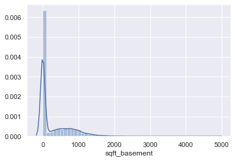

# Linear Regression Project
##  Introduction
Online property companies offer valuations of houses using machine learning techniques. The aim of this report is to predict the house sales in King County, Washington State, USA using Multiple Linear Regression (MLR). The dataset consisted of historic data of houses sold between May 2014 to May 2015. We will predict the sales of houses in King County with an accuracy of at least 75-80% and understand which factors are responsible for higher property value - $650K and above.”

The dataset consists of house prices from King County an area in the US State of Washington, this data also covers Seattle. The dataset was obtained from Kaggle. This data was published/released under CC0: Public Domain. Unfortunately, the user has not indicated the source of the data. Please find the citation and database description in the Glossary and Bibliography. The dataset consisted of 21 variables and 21613 observations.

Data Cleaning & EDA
In this section, some important features were selected for analyzing based on the feature information. For example, the square feet of the house and the numbers of the house. Obviously, normally the bigger size the house is, the more room there might be, and one variable can partially explain another one. So in order to avoid multicollinearity, I selected variables that can explain the independent variables well.

## Distribution of Target and Inputs

####
As we can see that the distributions of price and the sqft of living are right skewedm, so we can apply transformation methods or outlier removal moethods to make them normal distributied. Besides, the data type of condition is categorical data, and most points of "condition" are located in 3.
Finally regarding the column of sqft_basement, the most values are "0" which means that those houses do not have basement. So what I did is to create a new dummy variable for sqft_basement - if a house has a basement, the value is "1" otherwhise  "0".

## Features VS Target (Linearity and Homoskedasticity)

![images/distribution_of_boxplot['condition'],[price].png](images/distribution_of_boxplot['condition'],[price].png)
![images/distribution_of_boxplot[sqft_basement].png](images/distribution_of_boxplot[sqft_basement].png)

-   The first image shows that the linearity between price and sqft_living. The first sub-plot displays the scatter plot before log transformation, and the second one is the scatter plot of log transformation of both variables.  
-   The second image presents the higher condition the house is the higher price it will be.
- Last but not the least, based on the last image, we can see that if a house has a basement, its price might be higher than other houses which do not have basemnent.

## Modeling

.png)
.png)
####
In this modeling part,sklearn-linear Regression was applied. first of all, I used train test split to obtain train and test data by the ratio 80% and 20% respectively. The distribution of residuals is roughly normal distributed. The model can be improved, if more features can be added. 
